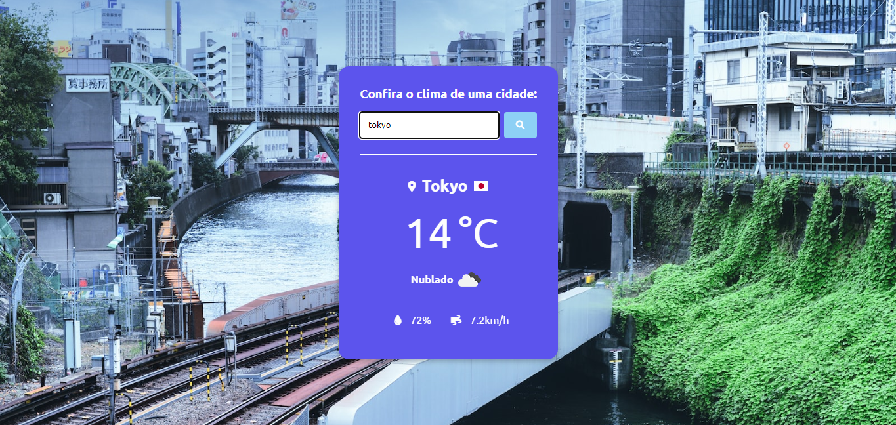

# Site de clima com API openweather
[🔗 Clique aqui para acessar](https://openweathermap.org/api)

Projeto construido a partir da aula do professor Matheus Battisti - Hora de Codar

[▶️ Clique aqui para acessar](https://www.youtube.com/watch?v=VS8EBgPwsSU)

# Para ver o site completo:
[🔗 Clique aqui para acessar](https://gabrielmeno.github.io/API-weather)

## 🛠️ Tecnologias

- HTML
- CSS
- JavaScript
- Git e Github

## ✉️ Contato

gabrielmenoncin38@gmail.com